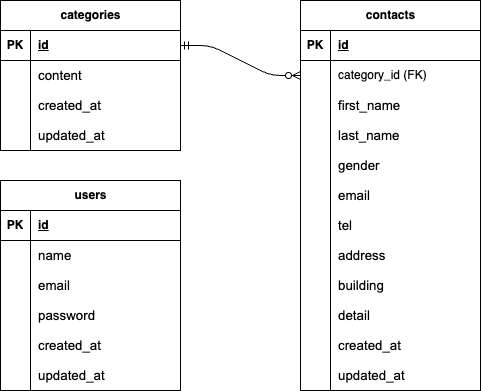

# coachtech-contact-form

## アプリケーション概要
お問い合わせフォーム機能および管理画面機能を実装したLaravelアプリケーションです。

ユーザーはお問い合わせの送信ができ、  
管理者はログイン後にお問い合わせ一覧の確認・検索・削除・CSVエクスポートが可能です。

---

## 環境構築

### ① リポジトリをクローン

git clone git@github.com:hana-ka/coachtech-contact-form.git
cd coachtech-contact-form

### ② Dockerコンテナをビルド・起動

docker-compose up -d –build

### ③ PHPコンテナへ入る

docker-compose exec php bash

### ④ Composerインストール

composer install

### ⑤ .envファイル作成

cp .env.example .env

※ `.env` 内のDB設定が `docker-compose.yml` と一致しているか確認してください。

### ⑥ アプリケーションキー生成

php artisan key:generate

### ⑦ マイグレーション・シーディング実行

php artisan migrate –seed

---

## 使用技術（実行環境）

- PHP 8.1.34
- Laravel 8.83.29
- MySQL 8.0.26
- Docker
- Docker Compose

---

## ER図

---

## URL

- お問い合わせフォーム: http://localhost/
- 管理画面: http://localhost/admin
- ユーザー登録: http://localhost/register
- ログイン: http://localhost/login

---

## 機能一覧

### お問い合わせ機能
- 入力画面
- バリデーション（FormRequest使用）
- 確認画面
- 送信完了画面

### 管理画面機能
- ログイン認証（authミドルウェア）
- 一覧表示（ページネーション）
- 検索機能
- 削除機能
- CSVエクスポート機能